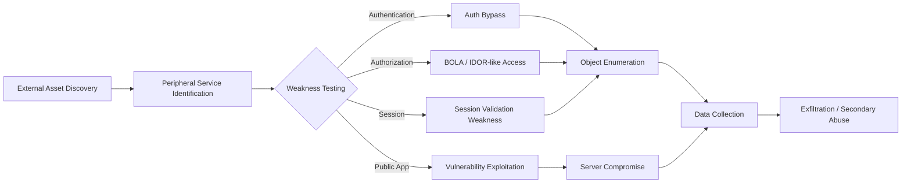

> **분석 기준일: 2026-10-06 KST**
>
> 이 글은 금융당국·피해 금융사 관련 보도·공개 보안 분석을 교차 검토해 작성했다.  
> 실제 공격 요청, 내부 로그, 악성코드 샘플, 전체 IOC는 아직 공개되지 않았으므로 **확인된 사실 / 기술적 해석 / 미확인 사항**을 분리한다.

## TL;DR

2026년 9월 말부터 국내 은행·저축은행·캐피탈·상호금융·온투업으로 확산된 침해사고의 핵심은 **Core Banking 자체의 직접 침해보다 인터넷에 노출된 주변 업무지원 시스템(Satellite System)을 반복적으로 탐색하고, 인증·인가·세션·단말기 접근통제의 빈틈을 악용했다는 점**이다.

현재 공개된 사례에서 반복적으로 등장하는 공격면은 다음과 같다.

- 대출모집인 조회 서비스
- RM/PB 모바일 업무지원
- ODS(영업지원) 시스템
- 외주·개발자용 웹페이지
- 공개 조회 페이지
- 외부 솔루션 및 레거시 웹 서비스

신한은행 사례에서는 정상적인 본인확인 절차를 우회한 뒤 조회값을 반복적으로 변경해 유효한 고객 식별자를 찾고 다른 조회 기능과 연결해 정보를 수집한 것으로 보도됐다. 기술적으로는 단순한 Credential Stuffing보다 **Authentication Bypass + Object Enumeration + Broken Object Level Authorization(BOLA)/IDOR 계열 문제**와 더 가까운 행위다.

한편 일부 공격 관련 서버에서 중국어 기반 자율 침투테스트 도구 **ARTEX** 관련 문자열이 발견됐다는 분석이 있었고, 금융당국도 AI 활용 가능성을 조사하고 있다. 그러나 **ARTEX가 실제 각 금융사 침해를 수행했다는 것은 아직 공식 확인되지 않았다.**


---

## 1. 사건을 "AI 해킹"보다 Attack Surface 문제로 봐야 하는 이유

이번 사고는 언론에서 주로 "AI 해킹"으로 불리고 있다. 그러나 사고 대응 관점에서는 AI 여부보다 **어떤 시스템이 외부에 노출됐고, 어떤 보안 통제가 빠져 있었는가**가 더 중요하다.

금융당국이 공개적으로 언급한 사고유형은 크게 다음 범주로 정리할 수 있다.

1. 본인인증이 충분하지 않은 정보 조회 서비스
2. PB/RM 등 직원 업무지원 시스템의 접근통제 미흡
3. 세션 검증이 충분하지 않은 웹페이지
4. 알려진 웹 취약점 또는 외부 솔루션 취약점
5. 악성코드 설치 후 로그·개인정보 수집 가능성이 있는 서버 침해

즉 이번 사건은 하나의 CVE나 하나의 악성코드가 모든 금융사를 뚫은 단일 공격이라기보다, **공격자가 여러 인터넷 노출 자산을 빠르게 탐색하고 성공 가능한 취약 경로를 선택한 캠페인**으로 보는 편이 현재 공개정보와 잘 맞는다.

### Core Banking과 Satellite System의 보안 격차

금융사는 인터넷뱅킹·모바일뱅킹·계정계에 강한 보안통제를 적용한다. 하지만 조직 전체 공격면은 그보다 훨씬 넓다.

```text
                         Internet
                            │
            ┌───────────────┼────────────────┐
            │               │                │
            ▼               ▼                ▼
     고객용 핵심채널    업무지원 시스템      협력사/외주
    Internet/Mobile    RM/PB/ODS/Loan       Vendor/Dev
            │               │                │
      강한 인증/MFA     상대적으로 약한       별도 운영
      다중 보안통제      인증·인가 가능성      Legacy 가능성
            │               │                │
            └───────────────┼────────────────┘
                            ▼
                     내부 고객/업무 데이터
```

공격자는 가장 잘 방어된 입구보다 **가장 덜 관리된 입구**를 찾는다.

---

## 2. 공개정보 기반 사건 타임라인


공개 보도를 종합하면 9월 말 여러 금융사를 대상으로 공격이 겹치는 양상이 나타난다.

| 시점 | 기관/영역 | 공개된 내용 |
|---|---|---|
| 9월 27일 전후 | 온투업체 등 | 외부 불법 접근 정황 |
| 9월 27~29일 | KB국민은행 | RM/PB 업무지원 계열 공격 |
| 9월 28~30일 | 신한은행 | 대출모집인용 조회 서비스 비정상 접근 |
| 9월 30일 | 하나은행 | ODS 영업지원 시스템 공격 |
| 9월 30일 | 예가람저축은행 | 외부 솔루션 원격 취약점 가능성 제기 |
| 10월 1~2일 | BNK부산은행 | 외부 웹서버 공격, 세션 검증 미흡 확인 |
| 10월 2~5일 | 금융권 전체 | 유사 흔적 조사, 공격정보 공유, 전수점검 |

중요한 점은 단순한 순차 공격보다 **여러 금융사를 병렬로 훑는 형태**가 더 자연스럽다는 것이다.

---

## 3. 신한은행: 가장 기술적 재구성이 가능한 사례

현재 공개된 사례 중 공격행위를 가장 구체적으로 추정할 수 있는 사례다.

### 3.1 공격 표면

공격 대상은 일반 인터넷뱅킹이 아니라 **대출모집인이 자신이 접수한 대출 진행상황을 확인하는 조회 서비스**였다.

이런 서비스는 보통 고객용 금융거래 시스템보다 기능이 제한적이고 사용대상도 좁다. 그러나 조회 결과에 고객 데이터가 연결되어 있다면 보안 중요도는 결코 낮지 않다.

### 3.2 본인확인 우회

공개 보도에 따르면 공격자는 정상적인 본인확인 절차를 거치지 않고 조회기능을 사용한 것으로 알려졌다.

```text
[정상]
대출모집인
  └─ 본인확인
      └─ 자신이 취급한 건만 조회

[공격]
외부 공격자
  └─ 본인확인 우회 또는 누락된 경로
      └─ 조회기능 직접 접근
```

여기서 중요한 것은 로그인 화면 존재 여부가 아니다.

웹 보안에서 다음 두 조건은 다르다.

- Authentication: "누구인가?"
- Authorization: "이 객체를 볼 권한이 있는가?"

로그인이 존재해도 서버가 객체 단위 권한을 검증하지 않으면 IDOR/BOLA가 가능하다.

### 3.3 Object Enumeration

공격자가 조회 입력값을 변경하면서 정상 응답을 반환하는 값을 식별하고, 얻은 식별값을 다른 조회 서비스에 연결한 것으로 보도됐다.

개념적으로 재구성하면 다음과 같다.

```text
GET /lookup?customer_key=A1
→ not found

GET /lookup?customer_key=B7
→ not found

GET /lookup?customer_key=C3
→ valid object
       │
       ▼
관련 조회 기능 호출
       │
       ├─ 이름
       ├─ 연락처
       ├─ 연소득
       └─ 대출정보
```

실제 endpoint·parameter 형식은 공개되지 않았다. 위 예시는 공격 메커니즘을 설명하기 위한 **추상화**다.

### 3.4 Credential Stuffing과 구분

일부 보도에서는 공격 자동화와 관련해 Credential Stuffing이라는 표현도 등장한다.

그러나 신한 사례에서 공개된 핵심 행동은:

```text
ID + Password 재사용
```

보다

```text
Parameter/Object 값 변화
→ 유효 객체 판별
→ 관련 조회 기능 연쇄 호출
```

에 더 가깝다.

따라서 기술 보고서에서는 최소한 다음과 같이 분리할 필요가 있다.

| 분류 | 의미 | 현재 신한 사례 적합성 |
|---|---|---|
| Credential Stuffing | 유출 ID/PW 대입 | 직접 증거 부족 |
| Authentication Bypass | 본인확인/인증 절차 우회 | 공개 보도와 부합 |
| IDOR/BOLA | 다른 사용자의 객체 접근 | 행위상 가능성 높음 |
| Enumeration | 값 변경으로 유효 객체 탐색 | 공개 보도와 부합 |
| API Chaining | 한 API 결과를 다른 조회에 재사용 | 가능성 높음 |

---

## 4. KB국민은행: RM/PB 업무지원 시스템

KB국민은행에서는 RM/PB 등 직원이 사용하는 모바일 업무지원 시스템 계열에서 침해가 확인됐다.

이 유형에서 중요한 보안 질문은 다음과 같다.

### 단말기 신뢰

```text
등록 단말
   │
   ▼
Device Certificate / MDM / MFA
   │
   ▼
업무지원 Web/API
```

만약 실제 Web endpoint가 단말 검증 없이 인터넷에서 접근 가능하다면 애플리케이션 보안통제가 마지막 방어선이 된다.

### 서버 측 권한검증

모바일 앱에서 버튼을 숨기거나 특정 메뉴 진입을 막는 것은 접근통제가 아니다.

```text
Client-side restriction != Server-side authorization
```

서버는 모든 요청마다 다음을 확인해야 한다.

```text
Subject
  +
Role
  +
Device
  +
Session
  +
Requested Object
  +
Business Context
```

---

## 5. 하나은행: ODS가 보여주는 '업무 편의 시스템' 리스크

하나은행에서는 영업지원시스템(ODS)에서 비정상 접근과 개인정보 유출이 확인됐다.

ODS 같은 시스템은 현장 영업을 위해 외부 네트워크에서 접근해야 하는 경우가 많다.

따라서 일반 내부업무 시스템보다 공격면이 커질 수 있다.

### 보안 모델

```text
Internet
  │
  ▼
WAF / Access Gateway
  │
  ▼
Device Authentication
  │
  ▼
User MFA
  │
  ▼
ODS
  │
  ▼
Fine-grained Authorization
  │
  ▼
Customer Data
```

이 중 하나라도 생략되면 "직원이 편하게 접근하는 시스템"이 "공격자도 쉽게 접근하는 시스템"으로 변할 수 있다.

---

## 6. BNK부산은행: Session Validation 문제

부산은행 사고에서 특히 중요한 공개 단서는 **일부 웹페이지의 세션 검증 미흡**이다.

세션 기반 웹서비스에서 흔한 오류는 다음과 같다.

- 특정 URL만 인증 middleware에서 제외
- 로그인 후 생성된 session을 다른 경로에서 충분히 검증하지 않음
- session과 device/IP/context 결합 부족
- session fixation/재사용 통제 부족
- API와 화면 간 인증정책 불일치

개념적으로는 다음과 같다.

```text
             ┌── Page A : Session Check OK
Login ───────┼── Page B : Session Check OK
             └── Page C : Validation Missing
                           │
                           ▼
                        Data Access
```

"로그인 기능이 있다"는 사실과 "모든 데이터 endpoint에서 세션을 검증한다"는 것은 다르다.

---

## 7. 예가람저축은행: 별도의 Server Compromise 계열 가능성

예가람저축은행은 사용 중인 **외부 솔루션의 원격 취약점**을 이용한 공격 가능성을 언급했다.

이 경우 앞선 BOLA/인가 우회 사례와 공격 체인이 달라질 수 있다.

```text
Internet
   │
   ▼
Third-party Solution
   │
   ▼
Known/Unknown Vulnerability
   │
   ▼
Remote Exploitation
   │
   ▼
Server Compromise
   │
   ├─ Process Execution
   ├─ Webshell/Malware 가능성
   ├─ Log/Data Access
   └─ Exfiltration
```

현재 제품명·CVE·악성코드 hash·C2는 공개되지 않았으므로 특정 취약점을 연결하는 것은 이르다.

---

## 8. 공개정보로 재구성한 Kill Chain


이번 캠페인을 가장 보수적으로 재구성하면 다음과 같다.



### MITRE ATT&CK / OWASP 매핑

| 단계 | 기술적 해석 | Mapping | 확신도 |
|---|---|---|---|
| External Recon | 공개 금융사 자산 탐색 | ATT&CK T1595 Active Scanning | 중 |
| Public App Attack | 외부 웹/솔루션 취약점 | T1190 Exploit Public-Facing Application | 높음 |
| Authentication | 본인확인 누락/우회 | OWASP Authentication Failures | 높음 |
| Object Access | 객체 식별값 변경 | OWASP API1 BOLA / IDOR | 중~높음 |
| Access Control | RM/PB/ODS 권한 검증 | OWASP Broken Access Control | 높음 |
| Session | 일부 페이지 세션 검증 미흡 | Session Management Failure | 높음 |
| Collection | 반복적인 개인정보 조회 | T1119 Automated Collection 유사 | 중 |
| Local Data | 서버·로그 데이터 수집 | T1005 Data from Local System 가능 | 중 |
| Exfiltration | 외부 반출 | Exfiltration tactic | 방식 미공개 |

> ATT&CK technique는 행위가 충분히 공개되지 않은 구간에서 **가설적 매핑**이다. 침해사고 보고서에서는 "confirmed"와 "assessed"를 분리해야 한다.

---

## 9. ARTEX와 AI Agent: 어디까지 확인됐는가


일부 공격 관련 웹서버의 HTML title에서 다음 문자열 계열이 관찰됐다는 분석이 공개됐다.

```text
ARTEX 自主渗透测试控制台
```

ARTEX는 공개된 AI 기반 자율 침투테스트 프로젝트로 알려져 있다. 이런 유형의 프레임워크는 일반적으로 다음 역할을 수행할 수 있다.

```text
               Planner / LLM
                    │
       ┌────────────┼────────────┐
       ▼            ▼            ▼
    Recon        Web Test     Validation
       │            │            │
       └────────────┼────────────┘
                    ▼
              Knowledge Graph
                    │
                    ▼
             Next Action Plan
```

### AI가 실제로 바꾸는 것은 무엇인가

AI Agent가 반드시 0-day를 만들어내야 위협적인 것은 아니다.

기존 공격 자동화:

```text
Scanner → Fixed Rule → Fixed Payload → Result
```

Agentic Workflow:

```text
Observe
  ↓
Reason / Select
  ↓
Run Tool
  ↓
Interpret Result
  ↓
Choose Next Action
  ↺
```

차이는 **결정 루프**에 있다.

공격자가 수동으로 하던 다음 작업을 더 빠르게 반복할 수 있다.

- 어느 서비스부터 볼 것인지 선택
- 응답에 따라 다음 파라미터 결정
- 실패한 경로를 버리고 다른 endpoint 탐색
- 여러 host를 병렬 처리
- 툴 결과를 요약해 공격경로 갱신
- 차단 후 접근경로·인프라 변경

### 그러나 Tool Attribution은 아직 미확정

현재 확인 가능한 수준과 단정하면 안 되는 수준을 구분해야 한다.

#### 확인 또는 강한 정황

- 공격 관련 인프라에서 ARTEX 관련 문자열이 관찰됐다는 보안업계 분석
- 여러 금융사에서 유사한 자동화 공격 정황
- 금융당국이 AI 활용 가능성을 조사 중
- 여러 금융사에서 동일 공격자 IP가 발견됐다는 당국 설명

#### 아직 미확인

- ARTEX가 특정 금융사 공격을 실제 실행했는지
- 모든 침해가 동일 공격자의 행위인지
- AI가 exploit code를 생성했는지
- 특정 국가 또는 APT 조직이 배후인지
- 공격에 사용된 LLM/model/provider

ARTEX가 중국어 UI를 사용한다는 점만으로 중국 공격자를 attribution할 수도 없다.

---

## 10. 왜 IP IOC만으로 탐지하면 실패하는가

이번 사고에서 여러 국가의 IP가 사용되고, 차단 이후 다른 접근 시도가 이어졌다는 보도가 있다.

단순 탐지:

```text
src_ip IN IOC_LIST
```

는 공격 인프라 교체에 취약하다.

보다 유효한 탐지 단위는 **행동 묶음**이다.

```text
URI 반복
  +
Object/Parameter 변화
  +
Source IP 변화
  +
짧은 시간 다수 HTTP 200
  +
동일 계정/세션 공유
  +
관련 API 연속 호출
```

### 탐지 가설 1: Object Enumeration

예시 Splunk SPL:

```spl
index=web
| bin _time span=5m
| stats count
        dc(uri_query) as unique_queries
        dc(src_ip) as source_ips
        values(status) as status
  by _time, uri_path, session_id
| where unique_queries > 50 AND count > 100
| sort - count
```

환경에 따라 `uri_query` 전체가 아니라 고객번호 등 민감 파라미터를 마스킹한 별도 normalized field를 만들어야 한다.

### 탐지 가설 2: 한 세션의 다중 IP 사용

```spl
index=web session_id=*
| bin _time span=15m
| stats dc(src_ip) as ip_count
        values(src_ip) as src_list
        dc(user_agent) as ua_count
        count
  by _time, session_id, user
| where ip_count >= 3 OR ua_count >= 3
```

VPN·NAT·모바일망 특성 때문에 단독으로 차단 룰로 사용하면 안 된다.

### 탐지 가설 3: 다수 객체의 성공 조회

```spl
index=api status=200
| stats dc(object_id) as objects
        count
        min(_time) as first_seen
        max(_time) as last_seen
  by user, session_id, src_ip, endpoint
| eval duration=last_seen-first_seen
| where objects > 100 AND duration < 600
```

핵심은 "요청 수"만 보는 것이 아니라 **서로 다른 객체를 몇 개 조회했는가**다.

### 탐지 가설 4: IP 회전 + 동일 행위

```spl
index=web
| eval behavior=method."|".uri_path."|".user_agent
| bin _time span=10m
| stats dc(src_ip) as src_count
        dc(session_id) as sessions
        count
  by _time, behavior
| where src_count > 10 AND count > 200
```

공격자가 IP를 바꿔도 URI·요청 구조·속도·응답패턴은 완전히 바뀌지 않을 수 있다.

---

## 11. 로그에서 반드시 확인해야 할 필드

이번 유형의 사고는 WAF 로그 하나로 끝나지 않는다.

### Reverse Proxy / WAF

- source IP
- X-Forwarded-For chain
- URI
- HTTP method
- status
- request size / response size
- User-Agent
- TLS fingerprint 가능 시 JA3/JA4
- WAF rule hit
- upstream host

### Application

- user/session ID
- object/customer identifier
- authorization result
- authentication method
- device ID
- MFA state
- API function name
- response record count
- correlation/request ID

### IAM / Authentication

- 로그인 성공/실패
- MFA challenge
- device registration
- token issuance
- session refresh
- account lock
- password reset
- suspicious country/ASN

### Database

- 동일 사용자/서비스 계정의 대량 SELECT
- 짧은 시간의 high-cardinality object 조회
- 평소보다 큰 result set
- 비정상 업무시간 조회
- application request ID와 DB query 연계

---

## 12. Incident Hunting을 위한 실무 체크

### Step 1 — 외부 공격면 목록부터 다시 만든다

CMDB가 아니라 **실제로 인터넷에서 보이는 자산** 기준으로 본다.

- 전체 FQDN
- Public IP
- CDN/WAF origin
- VPN
- 직원 모바일 서비스
- Partner/Vendor Portal
- 대출모집인/상담사 시스템
- Test/Dev/Staging
- API Gateway
- 오래된 서브도메인
- 외부 솔루션

### Step 2 — "로그인 없는 조회"를 찾는다

특히 다음을 우선점검한다.

```text
GET /lookup/*
GET /search/*
GET /result/*
GET /status/*
POST /query/*
POST /api/*/detail
```

문자열 자체가 취약점이라는 뜻은 아니다. 조직 내 route inventory와 대조해 인증·인가 middleware가 빠진 endpoint를 찾는 목적이다.

### Step 3 — 객체 단위 권한검증

다음 테스트 케이스를 코드와 테스트 환경에서 검증한다.

```text
User A + Object A → Allow
User A + Object B → Deny
User B + Object A → Deny
No Session + Object A → Deny
Expired Session + Object A → Deny
Unregistered Device + Object A → Deny
```

### Step 4 — 세션을 웹페이지 단위가 아니라 공통 middleware에서 검증

페이지마다 개발자가 직접 검증 코드를 쓰면 누락이 발생하기 쉽다.

```text
Request
  ↓
Central AuthN/AuthZ Middleware
  ↓
Route Handler
  ↓
Business Logic
```

### Step 5 — 로그를 데이터 유출량 관점으로 본다

"공격 요청이 있었나?"보다 다음이 중요하다.

> **공격자가 실제로 몇 개의 서로 다른 객체를 성공적으로 읽었는가?**

---

## 13. 방어 성공 사례가 주는 의미

일부 금융사는 유사 공격을 받았지만 정보유출이 확인되지 않았다.

이 차이는 매우 중요하다.

AI Agent가 사용됐다고 가정해도 공격자가 결국 통과해야 하는 것은 기존 통제다.

```text
MFA
Device Binding
Server-side Authorization
Session Validation
Rate Limiting
WAF
Patch Management
Behavior Analytics
```

AI는 취약점을 더 빠르게 찾을 수 있지만, **존재하지 않는 인증누락을 만들어내지는 않는다.**

따라서 "AI 방어 제품 도입"보다 먼저 해야 할 일은 External Attack Surface와 기본 Web/API Security를 정리하는 것이다.

---

## 14. 공격 관점에서 가장 위험한 구조

이번 사건군을 통해 특히 위험한 설계 패턴을 추릴 수 있다.

### 14.1 Security by Obscurity

```text
"직원만 URL을 안다"
"대출모집인만 사용한다"
"앱에서만 호출된다"
```

인터넷에 노출된 endpoint는 결국 발견된다고 가정해야 한다.

### 14.2 Client Trust

```text
Mobile App에서만 버튼 노출
→ API도 안전할 것이라는 가정
```

공격자는 앱 UI를 사용하지 않고 API를 직접 호출한다.

### 14.3 Object ID를 권한으로 착각

```text
/customer/839201
/customer/839202
/customer/839203
```

식별자가 복잡하거나 예측하기 어려워도 권한검증을 대체하지 못한다.

### 14.4 Core와 Peripheral의 보안등급 불일치

업무지원 시스템에서 핵심 개인정보를 읽을 수 있다면 그 시스템도 데이터 중요도에 맞는 보안등급을 적용해야 한다.

---

## 15. AI Agent 시대에 탐지 전략이 바뀌어야 하는 부분

고정된 exploit signature만 찾는 방식은 Agentic Attack에 불리하다.

### 전통적 탐지

```text
Known Payload
→ Signature
→ Block
```

### 행동 기반 탐지

```text
Entity
  +
Sequence
  +
Rate
  +
Context
  +
Response
  +
Cross-system Correlation
```

예를 들어 다음 연쇄를 하나의 incident로 묶을 수 있어야 한다.

```text
Unknown IP
  ↓
수백 URI 탐색
  ↓
특정 endpoint에서 HTTP 200 증가
  ↓
parameter 다양성 증가
  ↓
유효 object 조회
  ↓
다른 API 호출
  ↓
대량 데이터 반환
```

이런 탐지는 SIEM 단일 룰보다 **session/entity 기반 correlation**이 더 적합하다.

---

## 16. IOC보다 IOA가 중요한 이유

현재 공개된 구체 IOC는 제한적이다.

따라서 현 시점에서 더 가치 있는 것은 IOA(Indicator of Attack)다.

| IOA | 설명 |
|---|---|
| Parameter Cardinality 급증 | 동일 endpoint에서 입력값 종류가 비정상 증가 |
| Object Access Cardinality | 한 세션이 매우 많은 고객/객체 조회 |
| Session-IP Fan-out | 동일 세션이 여러 IP에서 사용 |
| Endpoint Chaining | 특정 조회 후 다른 조회 endpoint 연속 접근 |
| Response Success Shift | 탐색 중 어느 순간 200 응답 비율이 증가 |
| IP Rotation | 동일 행동 패턴이 여러 출발지로 반복 |
| Low-and-Slow | 임계치 바로 아래 요청을 장시간 반복 |
| Dormant Endpoint Access | 평소 거의 쓰지 않는 레거시 기능 호출 |

---

## 17. 현재 공개되지 않은 정보

분석 시 다음 정보는 아직 확정된 것으로 취급하면 안 된다.

- 전체 공격 IP
- Domain / C2
- Malware hash
- 악성코드 샘플
- 정확한 HTTP request
- 실제 API endpoint
- 공격 parameter 명
- 예가람저축은행 외부 솔루션 제품명
- CVE 번호
- 실제 ARTEX job/task log
- 사용된 LLM
- Prompt
- Exfiltration protocol
- 공격자 신원
- 국가 attribution
- 단일 공격그룹 여부

정보가 공개될 경우 이 글은 별도 Revision으로 업데이트할 예정이다.

---

## 18. CSIRT 관점의 우선 대응 순서

### Priority 1 — External Attack Surface

```text
"우리가 관리하는 시스템"이 아니라
"인터넷에서 실제로 접근 가능한 시스템"을 기준으로 inventory를 다시 만든다.
```

### Priority 2 — Authentication / Authorization

특히 비핵심 업무지원 서비스의 서버 측 통제를 코드 수준에서 검증한다.

### Priority 3 — Session / Device

직원·협력사 서비스는 계정 인증만으로 충분하지 않다.

### Priority 4 — Behavioral Detection

IP blacklist보다 enumeration·object access·session anomaly 중심으로 전환한다.

### Priority 5 — Third-party Exposure

외부 솔루션, 수탁사, 개발사, 대출모집인 등 신뢰경계를 재검토한다.

### Priority 6 — Data Minimization

주변 시스템이 정말 주민번호·소득·대출한도까지 조회할 필요가 있는지 다시 검토한다.

---

## 결론

이번 금융권 연쇄 침해사고를 기술적으로 보면 핵심은 "AI가 은행 보안을 갑자기 무력화했다"가 아니다.

더 정확한 해석은 다음에 가깝다.

```text
넓은 External Attack Surface
        +
주변 업무 시스템의 보안통제 편차
        +
인증/인가/세션 취약점
        +
자동화된 고속 탐색
        =
대규모 반복 침해 가능성 증가
```

AI Agent가 실제 공격에 사용됐다면 가장 큰 변화는 exploit의 종류보다 **공격자의 탐색·판단·재시도 비용이 급격히 낮아진 것**이다.

공격자가 24시간 지치지 않고 수백 개의 endpoint를 탐색할 수 있는 환경에서는 방어자도 "알려진 IP 차단"에서 벗어나야 한다.

앞으로 중요한 것은:

- External Attack Surface Management
- Server-side Authorization
- API/Object-level Access Control
- Session/Device Trust
- Behavioral Analytics
- Entity-based Detection
- Third-party Risk
- Data Minimization

이다.

**가장 강한 시스템이 아니라 가장 약한 인터넷 노출 시스템이 조직 전체의 실제 보안수준을 결정한다.**

---

## References

### 공식·규제기관 및 주요 보도

- [Reuters — South Korea finance regulator holds emergency meeting over bank hacks](https://www.reuters.com/legal/litigation/south-korea-finance-regulator-holds-emergency-meeting-over-bank-hacks-2026-10-02/)
- [Reuters — South Korean president orders probe into data leaks across financial industry](https://www.reuters.com/world/asia-pacific/south-korean-president-orders-probe-into-data-leaks-across-financial-industry-2026-10-04/)
- [연합뉴스 — 금융사 해킹사고, 동일 공격자 IP 여러 곳서 발견…AI활용 추정](https://www.yna.co.kr/amp/view/AKR20261004027951002)
- [연합뉴스 — 온투업까지 손 뻗은 해킹…보안 기본기가 피해 여부 갈랐다](https://www.yna.co.kr/view/AKR20261004042751002)
- [연합뉴스 — AI로 상호금융까지 광범위 공격](https://www.yna.co.kr/view/AKR20261003042451002)
- [연합뉴스 — AI가 해커 손에 들렸다…은행권 덮친 해킹의 진화](https://www.yna.co.kr/amp/view/AKR20261002175500017)
- [Kyunghyang — Traces of Chinese-language AI infiltration at Shinhan Bank](https://www.khan.co.kr/en/article/202610022036007)
- [MoneyToday — Shinhan, KB Kookmin, Hana and Busan Bank data breaches](https://www.mt.co.kr/en/finance/2026/10/02/2026100218295644158)

### 기술 프레임워크

- [MITRE ATT&CK — Active Scanning T1595](https://attack.mitre.org/techniques/T1595/)
- [MITRE ATT&CK — Exploit Public-Facing Application T1190](https://attack.mitre.org/techniques/T1190/)
- [OWASP API Security Top 10 — API1 Broken Object Level Authorization](https://owasp.org/API-Security/editions/2023/en/0xa1-broken-object-level-authorization/)
- [OWASP Top 10 — Broken Access Control](https://owasp.org/Top10/A01_2021-Broken_Access_Control/)
- [OWASP Session Management Cheat Sheet](https://cheatsheetseries.owasp.org/cheatsheets/Session_Management_Cheat_Sheet.html)

---

### Revision Note

- **2026-10-06** — 최초 작성. 공개된 공격 흐름·AI/ARTEX 정황·탐지 가설을 기술적 관점에서 재구성.
